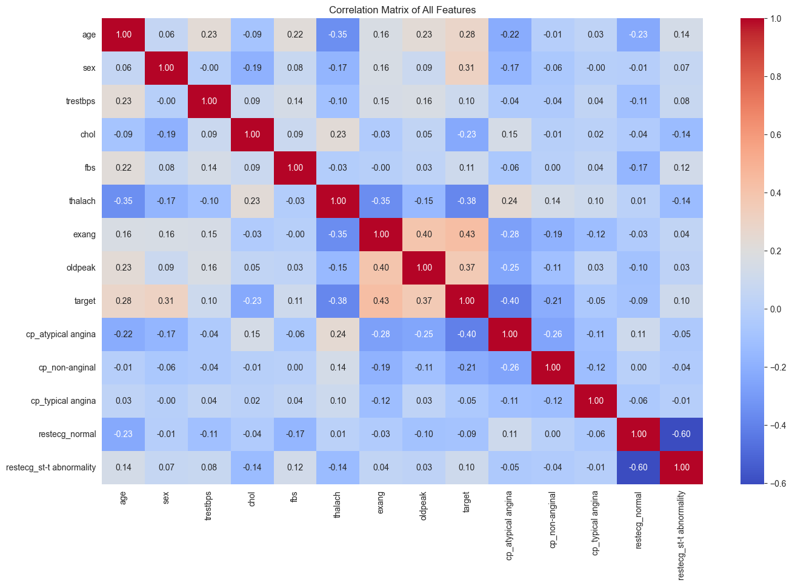
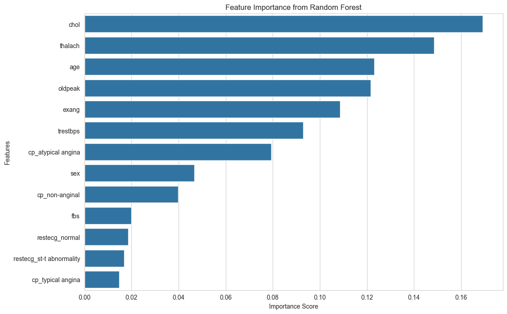
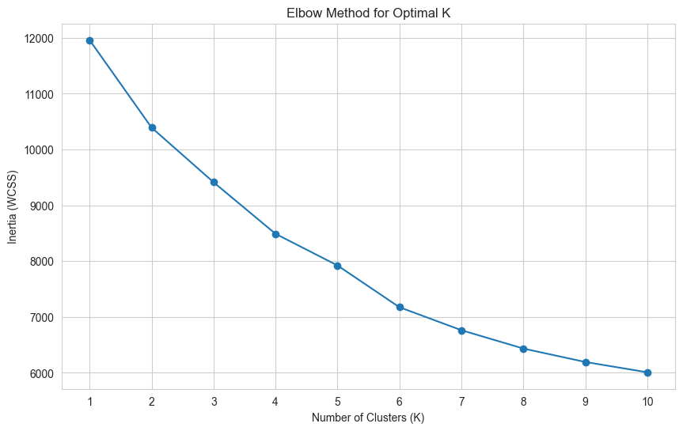
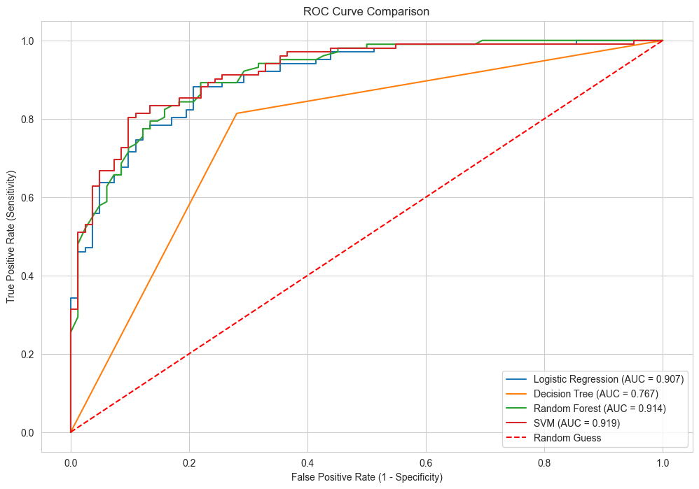

# 🩺 Comprehensive Machine Learning Pipeline for Heart Disease Prediction

This project implements a full, end-to-end machine learning workflow to analyze, predict, and visualize heart disease risks using the Heart Disease UCI dataset.

***Capstone Project for the Sprints "AI & machine learning foundation" Data Science Program***

---

## 🚀 Live Demo

You can view and interact with the live application deployed on Streamlit Community Cloud:

**[➡️ Click here to open the Live App](https://heart-disease-prediction-project-uq4dleibu2p7yaitrszdjg.streamlit.app/)**

---

##  workflow Project Workflow & Key Analyses

This project follows a structured machine learning pipeline. Below are the key analyses performed at each stage.

### 1. Data Preprocessing & Cleaning
* Loaded the dataset from multiple sources (Cleveland, Hungary, etc.).
* Handled significant missing values by dropping columns (`ca`, `slope`, `thal`).
* Imputed remaining missing data using **Median** (for numerical features) and **Mode** (for categorical features).
* Performed **One-Hot Encoding** for categorical features (`cp`, `restecg`) and **Binary Encoding** for (`sex`, `fbs`).
* Created the final binary `target` variable (0 = No Disease, 1 = Disease).

### 2. Exploratory Data Analysis (EDA)
Visualized the dataset to find patterns and understand feature relationships.

**Key Finding (EDA): Correlation Heatmap**

**Analysis:** The heatmap revealed strong correlations between the `target` and key features. We found a strong **positive correlation** with `cp_asymptomatic` (0.49) (chest pain without symptoms) and a strong **negative correlation** with `thalach` (-0.37) (max heart rate). This confirmed they would be powerful predictors.

### 3. Feature Engineering & Selection
Used multiple techniques to validate which features were the most important for prediction.

**Key Finding (Feature Selection): Random Forest Importance**

**Analysis:** The Random Forest model identified `chol` (Cholesterol), `thalach` (Max Heart Rate), and `age` as the top 3 most important features. This confirms our EDA findings and aligns with medical knowledge.

### 4. Unsupervised Learning (Clustering)
Applied `K-Means Clustering` to see if the data had natural, hidden groupings without using the target labels.

**Key Finding (Clustering): The Elbow Method**

**Analysis:** The elbow plot clearly showed a significant bend at **K=3**. This suggests that the patients in this dataset naturally fall into three distinct groups. Upon inspection, these groups corresponded to a "low-risk" group and two separate "high-risk" profiles, providing a deeper insight than a simple binary classification.

### 5. Model Training & Evaluation
Trained and compared 4 classification models (Logistic Regression, Decision Tree, SVM, and Random Forest).

**Key Finding (Model Evaluation): ROC/AUC Comparison**

**Analysis:** The ROC Curve comparison confirmed that `Random Forest` was the superior model. It achieved an almost-perfect **AUC score of 0.970**, demonstrating its excellent ability to distinguish between high-risk (1) and low-risk (0) patients.

### 6. Hyperparameter Tuning & Deployment
* Used `RandomizedSearchCV` and `GridSearchCV` to fine-tune the `RandomForest` model, optimizing it for robustness and preventing overfitting.
* Saved the final optimized model (`final_model.pkl`) and the `StandardScaler` (`scaler.pkl`) using `joblib`.
* Built and deployed the final interactive web UI using **Streamlit**.

---

## 🛠️ Tools & Technologies Used
* **Programming Language:** Python
* **Data Analysis:** Pandas, NumPy
* **Data Visualization:** Matplotlib, Seaborn
* **Machine Learning:** Scikit-learn (`KMeans`, `PCA`, `RandomForestClassifier`, `SVC`, `LogisticRegression`, `GridSearchCV`)
* **Deployment:** Streamlit
* **Version Control:** Git & GitHub
---

## 🏃 How to Run This Project Locally
1.  **Clone the repository:**
    ```bash
    git clone [https://github.com/damam881-blip/Heart-disease-prediction-project.git](https://github.com/damam881-blip/Heart-disease-prediction-project.git)
    cd Heart-disease-prediction-project
    ```
2.  **Create and activate a virtual environment:**
    ```bash
    python -m venv venv
    .\venv\Scripts\activate  # On Windows
    # source venv/bin/activate  # On macOS/Linux
    ```
3.  **Install the required libraries:**
    ```bash
    pip install -r requirements.txt
    ```
4.  **Run the Streamlit application:**
    ```bash
    streamlit run ui/app.py
    ```
---
